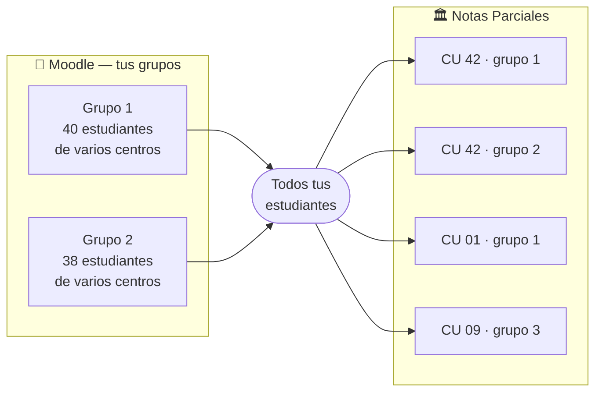
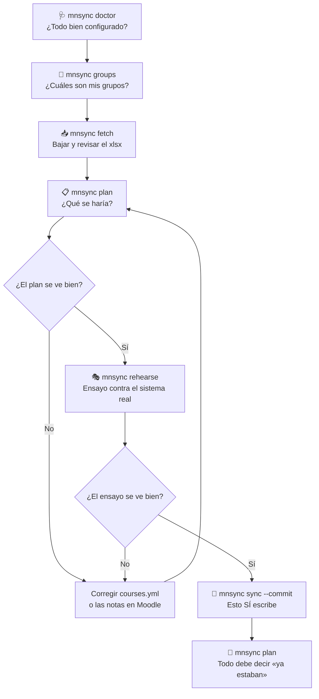

# 🔄 mnsync — De Moodle a Notas Parciales, sin volver a digitar

> **Lleva las notas que ya pusiste en Moodle al sistema oficial de Notas Parciales de la UNED, subiendo únicamente lo que falta.**

---

## 📑 Contenido

- [🔭 ¿Qué hace esto?](#-qué-hace-esto)
- [📚 Conceptos en 2 minutos](#-conceptos-en-2-minutos)
- [🛡️ ¿Puede dañar las notas de mis estudiantes?](#️-puede-dañar-las-notas-de-mis-estudiantes)
- [⚙️ Antes de empezar](#️-antes-de-empezar)
- [🚀 Instalación](#-instalación)
- [🔑 Configuración 1: tus credenciales](#-configuración-1-tus-credenciales)
- [🔎 Configuración 2: encontrar los datos de tu curso](#-configuración-2-encontrar-los-datos-de-tu-curso)
- [📝 Configuración 3: el archivo courses.yml](#-configuración-3-el-archivo-coursesyml)
- [👥 Sobre los grupos (leelo, es importante)](#-sobre-los-grupos-leelo-es-importante)
- [🧭 Primer uso, paso a paso](#-primer-uso-paso-a-paso)
- [✅ El flujo seguro](#-el-flujo-seguro)
- [📋 ¿Qué significa cada acción del plan?](#-qué-significa-cada-acción-del-plan)
- [🤖 Automatización semanal](#-automatización-semanal)
- [❓ Preguntas frecuentes](#-preguntas-frecuentes)
- [🩺 Solución de problemas](#-solución-de-problemas)
- [🔒 Seguridad](#-seguridad)

---

## 🔭 ¿Qué hace esto?

Hoy calificás en **Moodle**, y después volvés a escribir esas mismas notas, una por una, en el sistema de **Notas Parciales**. Es trabajo duplicado, es lento, y a la hora ciento de digitar es cuando aparecen los errores.

Este programa hace ese traslado por vos.

| | Antes | Con mnsync |
|---|---|---|
| ⏱️ **Tiempo** | Una o dos horas por grupo | Un comando |
| ✍️ **Digitación** | Nota por nota | Ninguna |
| 🔁 **Repetir** | Volver a revisar todo | Solo sube lo que falta |
| 📄 **Respaldo** | Ninguno | Un reporte de cada corrida |

**Qué SÍ hace:**

- Baja las notas de Moodle de **tus grupos** (no de los de otros profesores).
- Convierte la escala automáticamente: `89` en Moodle → `8.9` en Notas Parciales.
- Compara con lo que ya está en el sistema oficial y **sube solo la diferencia**.
- Deja un reporte de todo lo que hizo.

**Qué NO hace:**

- ❌ No califica por vos. Las notas las ponés vos en Moodle.
- ❌ No cambia notas que ya están puestas, salvo que se lo pidás explícitamente.
- ❌ No toca nada en Moodle. Ahí solo lee.

---

## 📚 Conceptos en 2 minutos

No hace falta saber programar, pero sí conviene tener claras estas nueve ideas. Todo el resto del documento las usa.

| Concepto | En palabras simples |
|---|---|
| **Moodle vs. Notas Parciales** | *Dónde calificás* y *dónde queda el registro oficial*. Son dos sistemas que no se hablan entre sí, y hasta hoy el puente entre ellos eras vos. |
| **Sincronizar** | Copiar de uno al otro **solo lo que falta**. Si una nota ya está bien puesta, no se toca. |
| **Grupo de Moodle** | Un curso se reparte en grupos entre los profesores que lo dan; vos tenés uno o dos. Sirve para saber **de quién** son los estudiantes. |
| **CU (Centro Universitario)** | El número entre paréntesis de la columna «Institución» de Moodle: `DESAMPARADOS (42)` → el CU es `42`. **Tu grupo mezcla estudiantes de muchos centros.** |
| **Grupo de Notas Parciales** | Adonde va la nota. Es de **un solo** centro universitario, y un mismo centro puede tener varios. El programa averigua solo cuál le toca a cada estudiante. |
| **Instrumento** | Cada casilla calificable del sistema oficial: `Tar1`, `Tar2`, `Proy1`. Tu «Tarea 1» de Moodle tiene que saber a cuál corresponde. |
| **Cédula / Número de ID** | La llave que une a un estudiante entre los dos sistemas. Si en Moodle está vacía o mal escrita, ese estudiante no se puede sincronizar. |
| **Escala 0–100 → 0–10** | Moodle usa 0 a 100; Notas Parciales usa 0 a 10. La conversión es automática: se divide entre 10. |
| **Prueba (*dry-run*)** | El programa te dice qué **haría**, sin hacer nada. Es lo que corre por defecto: para escribir de verdad hay que pedirlo aparte. |
| **Plan** | Un archivo que podés abrir en Excel y revisar **antes** de que se escriba una sola nota. |

---

## 🛡️ ¿Puede dañar las notas de mis estudiantes?

Es la pregunta correcta, y merece una respuesta honesta antes que cualquier instrucción de instalación.

**Hay siete protecciones, y ninguna se puede desactivar por accidente:**

| 🛡️ Protección | Qué impide |
|---|---|
| **No escribe por defecto** | Todos los comandos hacen una prueba. Para escribir de verdad hay que agregar `--commit` a mano. |
| **Plan revisable** | Antes de escribir se genera un archivo que abrís en Excel y revisás con calma. |
| **No sobrescribe** | Si una nota **ya está puesta** en el sistema, el programa no la toca: la reporta y sigue. Cambiarla requiere pedirlo explícitamente. |
| **Justificación registrada** | Si autorizás un cambio, queda anotado en el sistema de la UNED con su código, como manda el procedimiento. |
| **Freno de cantidad** | Si una corrida fuera a cambiar más notas de las esperadas en un mismo grupo, se detiene y te avisa en vez de escribir. |
| **Verificación de grupo** | Si Moodle no aplicara bien el filtro de grupo, el programa se detiene antes de bajar nada, para no tocar estudiantes de otros profesores. |
| **Nadie se pierde en silencio** | Si un estudiante no aparece en ningún grupo oficial, se lo nombra en el reporte. Nunca se le adivina un lugar. |

**Y esto es lo que NO puede hacer por vos:**

> [!IMPORTANT]
> Una nota escrita en Notas Parciales **no se deshace con este programa**. Si autorizás un cambio equivocado, hay que corregirlo por los canales normales de la UNED, igual que si lo hubieras digitado a mano.
>
> Por eso el flujo recomendado siempre termina en `--commit`, nunca empieza ahí.

---

## ⚙️ Antes de empezar

| Requisito | Detalle |
|---|---|
| 💻 **Computadora** | Windows 10 u 11, macOS o Linux |
| 🐍 **Python 3.10 o superior** | Al instalarlo, marcá la casilla *«Add Python to PATH»* |
| 🎓 **Cuenta de Moodle** | La misma con la que calificás |
| 🏛️ **Cuenta SSO UNED** | La del Entorno de Funcionarios, con acceso a Notas Parciales |
| 📊 **Notas ya puestas en Moodle** | Este programa traslada; no califica |

> [!IMPORTANT]
> **Un requisito que depende de tu Moodle, no de vos.** La exportación de calificaciones tiene que incluir las columnas **«Número de ID»** e **«Institución»**. Si al exportar a mano desde Moodle esas columnas aparecen, ya está listo. Si no, hay que pedirle a quien administra Moodle que las agregue. El programa te avisa con ese mensaje exacto si faltan.

---

## 🚀 Instalación

### Opción A — Instalador automático (Windows)

1️⃣ Descargá el proyecto:

```bash
git clone --recurse-submodules https://github.com/chhdeza/moodleToNotas-sync.git
cd moodleToNotas-sync
```

2️⃣ Doble click en:

```
instalar.bat
```

3️⃣ Abrí el archivo `.env` con el Bloc de notas y completá tus datos (siguiente sección).

### Opción B — Manual

```bash
git clone --recurse-submodules https://github.com/chhdeza/moodleToNotas-sync.git
cd moodleToNotas-sync

python -m venv .venv
.venv\Scripts\pip.exe install -e .        # Windows
# .venv/bin/pip install -e .              # macOS / Linux

copy .env.example .env                     # Windows
# cp .env.example .env                     # macOS / Linux
copy courses.example.yml courses.yml
```

> [!TIP]
> Usá siempre `.venv\Scripts\mnsync.exe` (o activá el entorno una vez). Así no dependés de que Windows tenga habilitada la ejecución de scripts.

> [!WARNING]
> El `--recurse-submodules` del `git clone` **no es opcional**. Sin él falta el script que habla con Notas Parciales. Si ya clonaste sin eso, corregilo con:
> ```bash
> git submodule update --init --recursive
> ```

---

## 🔑 Configuración 1: tus credenciales

Todo va en un archivo llamado **`.env`**. Ese archivo **nunca** se sube a Git: ya está protegido.

Son **cinco valores**, de **dos cuentas distintas**:

```ini
# ─── Moodle ──────────────────────────────────────
MOODLE_URL=https://aprende.uned.ac.cr
MOODLE_USERNAME=tu.usuario
MOODLE_PASSWORD=tu_contraseña_de_moodle

# ─── Notas Parciales (SSO UNED) ──────────────────
NP_NTLM_USER=jperez
NP_NTLM_PASSWORD=tu_contraseña_del_sso
```

> [!IMPORTANT]
> En `NP_NTLM_USER` va **solo el nombre de usuario**, sin `@uned.ac.cr`.
> Si tu correo es `jperez@uned.ac.cr`, poné `jperez`.

Comprobá que quedó bien:

```bash
mnsync doctor
```

---

## 🔎 Configuración 2: encontrar los datos de tu curso

Este es el paso que más cuesta, porque son códigos internos que no se ven a simple vista. Van en dos lugares.

### 📍 De Moodle: el número del curso

Está en la dirección de tu curso, en la barra del navegador:

```
https://aprende.uned.ac.cr/course/view.php?id=8067
                                              ▲
                                              └── course_id: 8067
```

### 📍 De Notas Parciales: los códigos de los menús

Son exactamente los menús desplegables que ya usás en la página de Captura de Notas:

```
┌──────────────────────────────────────────────────────────────────┐
│                 Página de Captura de Notas                       │
│                                                                  │
│  Año: [2026 ▼]           ← ano: "2026"                          │
│  PAC: [3 ▼]              ← pac: "3"                             │
│  Tipo: [Ordinaria ▼]     ← tipo: "O"                            │
│                                                                  │
│  Escuela: [03 ▼]         ← escuela: "03"                        │
│  Cátedra: [253 ▼]        ← catedra: 253                         │
│  Encargado: [ARODRIG… ▼] ← encargado: ARODRIGUEZP               │
│  Tutor: [0401780367 ▼]   ← tutor: "0401780367"                  │
│                                                                  │
│  Asignatura: [00883 ▼]   ← asignatura: "00883"                  │
│  Modelo: [4 ▼]           ← modelo: 4                            │
│                                                                  │
│  Centro Univ: [42 ▼]     ← no hace falta anotarlo               │
│  Grupo: [1 ▼]            ← no hace falta anotarlo               │
└──────────────────────────────────────────────────────────────────┘
```

> [!TIP]
> **El Centro Universitario y el Grupo no se anotan.** Tus estudiantes están repartidos en varios centros a la vez, y el programa averigua solo a cuál pertenece cada uno.

> [!TIP]
> **Los números de tus grupos de Moodle no los tenés que buscar.** Este comando te los muestra ya listos para copiar:
> ```bash
> mnsync groups --course <tu-curso>
> ```

> [!WARNING]
> **Cuidado con los ceros a la izquierda.** `01` no es lo mismo que `1`, y `00883` no es lo mismo que `883`. Por eso van entre comillas en el archivo. Si se pierde un cero, el servidor no da error: simplemente devuelve una lista vacía, que es mucho más difícil de notar.

---

## 📝 Configuración 3: el archivo `courses.yml`

Acá le decís al programa qué cursos sincronizar. **No lleva contraseñas**, solo códigos.

```yaml
courses:
  # "id" es un apodo que elegís vos; con él llamás al curso después.
  - id: redes-2026-3

    moodle:
      course_id: 8067              # de la URL de Moodle

      # LOS GRUPOS QUE DAS VOS, y solo esos.
      groups:
        - id: 38525                # de: mnsync groups
          name: "Grupo 1"
        - id: 38526
          name: "Grupo 2"

    # Estos son iguales para todo el curso.
    notas_parciales:
      ano: "2026"
      pac: "3"
      tipo: "O"
      asignatura: "00883"
      escuela: "03"
      catedra: 253
      encargado: ARODRIGUEZP
      tutor: "0401780367"          # tu cédula
      modelo: 4

    policy:
      allow_update: false          # ¿puede cambiar notas ya puestas?
      justificacion_codigo: 2005   # "Error de digitación"
      max_changes: 40              # freno por grupo de Notas Parciales
```

> [!NOTE]
> **No se indica a qué grupo de Notas Parciales va cada cosa.** El programa lo averigua solo la primera vez. Si querés ahorrarte esa espera, podés anotarlo — mirá la sección `destinos` en [`courses.example.yml`](courses.example.yml).

---

## 👥 Sobre los grupos (leelo, es importante)

Los dos sistemas agrupan a los estudiantes de maneras distintas, y esa es la raíz de casi todo lo demás. Vale dos minutos entenderlo.

### Cada sistema agrupa por algo diferente

| | Moodle | Notas Parciales |
|---|---|---|
| **Agrupa por** | Quién da la clase | De qué Centro Universitario es el estudiante |
| **Un grupo tiene** | Estudiantes de muchos centros | Estudiantes de un solo centro |
| **Para qué sirve acá** | Saber **de quién** son los estudiantes | Saber **dónde** va cada nota |

Tu grupo de Moodle es una mezcla: cuarenta estudiantes que pueden venir de diez centros universitarios distintos. En Notas Parciales, en cambio, cada uno va al grupo de **su** centro.



Fijate en algo: **el mismo centro (CU 42) aparece dos veces**, con grupos distintos. Pasa, y es normal — no todos los estudiantes de un centro están siempre en el mismo grupo.

### Por qué no hay que anotar nada de esto

Porque no se puede saber de antemano, y porque el programa lo averigua mejor que uno: le pregunta al sistema de la UNED, estudiante por estudiante, en qué grupo oficial está cada uno. Son todas consultas de lectura, así que no toca nada.

La primera corrida tarda un poco más por eso. Las siguientes ya van directo.

### Si alguien no aparece

Puede pasar que un estudiante esté en tu Moodle pero no en Notas Parciales. Es poco frecuente, y casi siempre significa que no quedó matriculado en la asignatura.

El programa **no se detiene por eso**: sube las notas de todos los demás y te deja el nombre de quien quedó afuera, arriba del reporte, para que lo consultes con registro.

Ahora bien, si falla **un centro universitario entero** —ningún estudiante de ese centro aparece— eso ya no es matrícula: es que algún código de la asignatura está mal. Ahí sí se detiene y te avisa.

---

## 🧭 Primer uso, paso a paso

Hacé esto la primera vez, en este orden, sin saltarte pasos.

**1️⃣ ¿Está todo bien configurado?**

```bash
mnsync doctor
```

**2️⃣ ¿Cuáles son mis grupos?**

```bash
mnsync groups --course redes-2026-3
```

Copiá los que son tuyos a `courses.yml`, bajo `moodle: groups:`. Nada más: no hay que decir a qué centro universitario van.

**3️⃣ Bajar las notas y revisarlas**

```bash
mnsync fetch --course redes-2026-3
```

> [!IMPORTANT]
> Abrí el archivo `.xlsx` que se generó en la carpeta `salida/` y comprobá dos cosas:
> - Que la columna **«Número de ID»** tenga las cédulas de verdad.
> - Que estén **solo tus estudiantes**, y no el curso completo.
>
> Estas dos comprobaciones se hacen una vez y valen para siempre.

**4️⃣ Ver qué se haría (sin escribir nada)**

```bash
mnsync plan --course redes-2026-3
```

Abrí el `notas_plan_*.csv` en Excel y mirá la columna `accion`.

**5️⃣ Ensayo contra el sistema real**

```bash
mnsync rehearse --course redes-2026-3
```

Se conecta de verdad al sistema de la UNED y hace todo el proceso, pero **intercepta la escritura**. Deja un archivo con exactamente lo que se escribiría:

```bash
mnsync leer-ensayo salida/rehearsal_redes-2026-3_*.jsonl
```

Revisá esa lista contra Moodle antes de seguir. La guía completa de pruebas
está en [docs/PRUEBAS-MANUALES.md](docs/PRUEBAS-MANUALES.md).

**6️⃣ La primera subida, chiquita**

Poné `max_changes: 1` en `courses.yml` y subí una sola nota:

```bash
mnsync sync --course redes-2026-3 --group 38525 --commit
```

Entrá a Notas Parciales en el navegador y comprobalo **con tus propios ojos**. Después subí `max_changes` a lo que corresponda.

**7️⃣ Ya en confianza**

```bash
mnsync sync --course redes-2026-3 --commit
```

**8️⃣ La comprobación final**

Volvé a correr el paso 4. Ahora todo debería decir **«ya estaban»**. Esa es la prueba de que funcionó.

---

## ✅ El flujo seguro



---

## 📋 ¿Qué significa cada acción del plan?

Al abrir el `notas_plan_*.csv` en Excel, la columna `accion` dice qué pasó con cada nota. La columna que más importa es la última.

| Acción | Qué significa | ¿Qué hago yo? |
|---|---|---|
| `upload` | Nota nueva, lista para subir | Nada, es lo normal |
| `skip_already_set` | Ya está igual en el sistema | Nada. Ver **muchas** de estas es buena señal |
| `mark_not_presented` | Se marcará como «no presentó» | Confirmá que de verdad no entregó |
| `would_overwrite` | Cambiaría una nota **ya existente** | 🛑 **Revisá.** No se toca sin permiso explícito |
| `skip_not_in_roster` | El estudiante es de **otro** grupo oficial | Nada: lo sube el plan del grupo que sí le toca |
| `skip_retirado` | Estudiante con retiro justificado | Nada |
| `review` | Caso raro; el programa prefiere no arriesgarse | 🛑 **Miralo con calma** |

> [!TIP]
> Si querés que sí cambie las notas ya existentes, agregá `--allow-update`. El cambio queda registrado en el sistema de la UNED con su código de justificación, como corresponde.

---

## 🤖 Automatización semanal

El proyecto trae una automatización que corre **sola, todos los lunes a las 5 de la mañana**, usando GitHub Actions.

### ¿Qué es GitHub Actions?

Es un servicio que ejecuta programas por vos en una computadora prestada, según un horario. No hay que dejar tu computadora encendida.

### Cómo se activa

1️⃣ Subí este proyecto a un repositorio **privado** en GitHub.

2️⃣ En **Settings → Secrets and variables → Actions**, agregá los cinco secretos:

```
MOODLE_URL          MOODLE_USERNAME     MOODLE_PASSWORD
NP_NTLM_USER        NP_NTLM_PASSWORD
```

3️⃣ Andá a la pestaña **Actions**, elegí *«Sincronizar notas»* y lanzala a mano con **`commit` en `false`**. Revisá el resumen.

4️⃣ Si se ve bien, dejala que corra sola.

### Qué pasa en cada corrida

- Sube las notas nuevas de todos tus cursos.
- Publica el reporte completo en la página de la corrida.
- Guarda el plan en «Artifacts» por 7 días, por si querés abrirlo en Excel.
- **Te abre un aviso (issue)** si algo falló o si un freno detuvo un grupo.

> [!CAUTION]
> **El repositorio tiene que ser privado.** Tus contraseñas quedan guardadas ahí como secretos: GitHub las cifra y las oculta en los registros, pero cualquiera con permiso de modificar el repositorio podría escribir un flujo que las lea.

> [!NOTE]
> Los archivos de la corrida llevan cédulas y notas de estudiantes. Se borran solos a los 7 días. Es información que ya manejás hoy al exportar el Excel a tu computadora; la diferencia es que aquí pasa por un servicio de Microsoft fuera del país, lo cual es una consideración institucional más que técnica.

---

## ❓ Preguntas frecuentes

<details>
<summary><strong>¿Qué pasa si lo corro dos veces?</strong></summary>

Nada malo. La segunda vez encuentra todo puesto y no escribe nada: todas las filas dicen `skip_already_set`. De hecho, correrlo dos veces es la mejor forma de comprobar que la primera funcionó.
</details>

<details>
<summary><strong>¿Y si me equivoco en un número de la configuración?</strong></summary>

En casi todos los casos el programa se detiene y te dice qué revisar. Los códigos de la asignatura (`asignatura`, `modelo`, `pac`, `ano`) son los más delicados, porque el sistema de la UNED **no da error** cuando están mal: devuelve listas vacías. El programa se da cuenta igual, porque entonces no aparece **ningún** estudiante de **ningún** centro universitario, y eso ya no puede ser casualidad. Corta la corrida antes de escribir.
</details>

<details>
<summary><strong>¿Alguien puede ver mi contraseña?</strong></summary>

En tu computadora, tu contraseña vive en el archivo `.env`, que nunca se sube a Git. Si usás la automatización semanal, vive en los secretos de **tu** repositorio de GitHub, cifrada.

Quien tenga acceso a tu computadora o a tu cuenta de GitHub podría llegar a ella, igual que a cualquier otra contraseña guardada.
</details>

<details>
<summary><strong>¿Puede subir la nota equivocada a un estudiante?</strong></summary>

Los estudiantes se emparejan por **cédula**, no por nombre ni por posición en una lista. Si la cédula de Moodle está bien, la nota va a quien corresponde. Si una cédula está mal o vacía, esa persona no aparece en ningún grupo oficial: **no se le escribe nada**, y su nombre queda listado arriba del reporte para que lo revises.
</details>

<details>
<summary><strong>¿Y si Moodle o la UNED cambian sus páginas?</strong></summary>

El programa está hecho para *repetir* los formularios que le manda el servidor, en vez de adivinar sus campos, así que aguanta bastantes cambios. Si algo se rompe igual, siempre queda la salida manual: exportás el Excel desde Moodle como siempre y el resto del proceso sigue funcionando.
</details>

<details>
<summary><strong>¿Tengo que dejar la computadora encendida?</strong></summary>

Para los comandos manuales, sí, mientras corren (segundos o pocos minutos). Para la automatización semanal, no: corre en los servidores de GitHub.
</details>

---

## 🩺 Solución de problemas

> [!TIP]
> Antes que nada, probá `mnsync doctor`. Revisa la configuración y te dice qué falta, sin escribir nada.

| 🚨 Síntoma | 💡 Causa probable | ✅ Solución |
|---|---|---|
| `Faltan credenciales en el archivo .env` | El `.env` no existe o está incompleto | Copiá `.env.example` como `.env` y completá los cinco valores |
| `No se encontró el archivo courses.yml` | Falta la configuración de cursos | Copiá `courses.example.yml` como `courses.yml` y editalo |
| `Moodle rechazó el usuario o la contraseña` | Datos de Moodle incorrectos | Revisá `MOODLE_USERNAME` y `MOODLE_PASSWORD` |
| `Notas Parciales rechazó el usuario` | Datos del SSO incorrectos | Revisá `NP_NTLM_USER` (va **sin** `@uned.ac.cr`) |
| `le faltan columnas necesarias: Número de ID` | Moodle no exporta esas columnas | Pedile a quien administra Moodle que las habilite en la exportación de calificaciones |
| `Se pidió el grupo N, pero Moodle quedó mostrando…` | El `moodle_group_id` no es de ese curso | Corré `mnsync groups` y corregí el número |
| `no aparecen en el grupo oficial` | `cu` o `grupo` equivocados | Comparalos con los menús de Captura de Notas |
| `El servidor no devolvió estudiantes` | Algún código del curso no corresponde | Revisá `asignatura`, `modelo`, `pac` y `grupo`. El sistema **no da error** con códigos malos: devuelve tablas vacías |
| `Esta corrida cambiaría N notas… el límite es M` | Saltó el freno de cantidad | Revisá el plan en Excel. Si está bien, subí `max_changes` |
| `Se venció la sesión` | La sesión con la UNED expiró | Volvé a ejecutar el mismo comando |
| `Falta el script de Notas Parciales` | Se clonó sin el submódulo | `git submodule update --init --recursive` |

### Los códigos de salida

| Código | Significa |
|---|---|
| `0` | Todo bien |
| `1` | Hubo un error |
| `2` | Un freno de seguridad detuvo un grupo. **No se escribió nada** en ese grupo |

---

## 🔒 Seguridad

### Lo que hay que cuidar

| Archivo | Qué tiene | Regla |
|---|---|---|
| `.env` | Tus dos contraseñas | **Nunca** a Git, nunca por correo ni WhatsApp |
| `salida/*.xlsx` | Cédulas, nombres, notas | Datos personales de estudiantes |
| `salida/notas_plan*.csv` | Cédulas y notas | Datos personales de estudiantes |
| `courses.yml` | Solo códigos de curso | Se puede compartir sin problema |

Todos los archivos con datos sensibles ya están excluidos de Git. Para comprobarlo:

```bash
git status
```

Si `.env` **no** aparece en la lista, la protección está funcionando.

### Sobre tu contraseña del SSO

> [!CAUTION]
> La contraseña del SSO UNED no abre solo Notas Parciales: abre tu correo, el Entorno de Funcionarios y todo lo demás. Tratala como lo que es — la llave de tu identidad institucional entera.
>
> Si sospechás que se filtró, **cambiala de inmediato** y avisá a la UNED.

### Sobre los datos de estudiantes

Las cédulas y notas que maneja este programa son **datos personales** protegidos por la Ley 8968. Son los mismos que ya manejás al exportar el Excel de Moodle a tu computadora, pero conviene tenerlo presente: no los subas a servicios de terceros ni los compartas fuera de lo estrictamente necesario.

---

## 📜 Licencia

[Apache License 2.0](LICENSE)

Construido sobre [grade-uploader](https://github.com/chhdeza/grade-uploader) y [Moodle-Grader](https://github.com/chhdeza/Moodle-Grader).

---

<div align="center">

**Hecho para la comunidad docente de la UNED Costa Rica**

</div>
