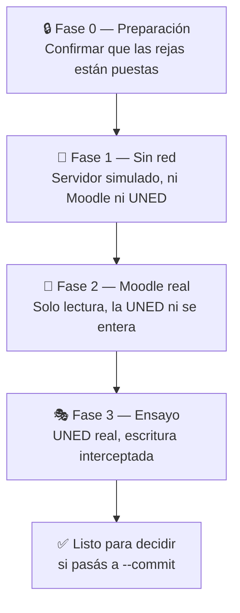

# 🧪 Guía de pruebas manuales

> **Objetivo:** validar que todo el sistema funciona de punta a punta **sin escribir una sola nota** en el sistema oficial de Notas Parciales.

Las 87 pruebas automáticas ya cubren la lógica. Lo que **no** pueden cubrir es tu realidad concreta: que tu Moodle exporte las columnas correctas, que los números de tus grupos de Moodle existan, que tus códigos de curso apunten a un grupo real. Eso es lo que se valida acá.

---

## 🗺️ Las cuatro fases



| Fase | Toca Moodle | Toca Notas Parciales | ¿Puede escribir? |
|---|---|---|---|
| 0 — Preparación | ❌ | ❌ | ❌ |
| 1 — Sin red | ❌ | ❌ (simulado) | ❌ |
| 2 — Moodle real | ✅ solo lectura | ❌ | ❌ |
| 3 — Ensayo | ✅ solo lectura | ✅ solo lectura | ❌ interceptada |

> [!IMPORTANT]
> Ninguna fase de esta guía escribe en Notas Parciales. El único comando que escribe es `mnsync sync --commit`, y **no aparece en ninguna parte de este documento**.

---

## 🔒 Fase 0 — Preparación

### 0.1 Instalar

```bash
git clone --recurse-submodules https://github.com/chhdeza/moodleToNotas-sync.git
cd moodleToNotas-sync
python -m venv .venv
.venv\Scripts\pip.exe install -e ".[dev]"
```

### 0.2 Confirmar que las rejas están puestas

Esto es lo primero por una razón: **todo lo demás depende de que estas protecciones funcionen.**

```bash
.venv\Scripts\python.exe -m pytest tests/test_fence.py tests/test_harness.py -v
```

**✅ Qué tenés que ver:**

```
tests/test_fence.py::test_la_escritura_no_sale_a_la_red PASSED
tests/test_fence.py::test_las_lecturas_pasan_de_largo PASSED
tests/test_fence.py::test_cada_escritura_bloqueada_queda_anotada PASSED
tests/test_fence.py::test_la_reja_deja_su_marca PASSED
tests/test_fence.py::test_la_verificacion_de_la_reja_corre_de_verdad PASSED
tests/test_harness.py::test_socket_guard_blocks_the_real_world PASSED
```

**Qué significa cada una:**

| Prueba | Qué demuestra |
|---|---|
| `test_la_escritura_no_sale_a_la_red` | La llamada que escribe (`actualizarNotas`) se responde **sin transmitirse** |
| `test_las_lecturas_pasan_de_largo` | Todo lo demás sí viaja: el ensayo ejercita el servidor real |
| `test_cada_escritura_bloqueada_queda_anotada` | Queda registro exacto de lo que se habría escrito |
| `test_la_reja_deja_su_marca` | La reja puede demostrar que está instalada |
| `test_socket_guard_blocks_the_real_world` | Una prueba que intente salir a internet **falla**, no escribe |

> [!CAUTION]
> Si **cualquiera** de estas cinco falla, **detenete acá**. No sigas con las otras fases hasta entender por qué. Una reja que no se puede verificar no protege nada.

---

## 🤖 Fase 1 — Sin red

Todo el proceso contra un servidor simulado que habla el mismo idioma que el de la UNED. Acá corre incluso el `--commit` real del script — pero contra el simulador, que anota cada escritura en un diario en vez de tocar ninguna base de datos.

### 1.1 La suite completa

```bash
.venv\Scripts\python.exe -m pytest -q
```

**✅ Esperado:** `67 passed`

Además, una advertencia que **querés** ver:

```
UserWarning: A test tried to use socket.socket.connect() with host "201.204.46.123"
```

Esa es la reja de red atajando un intento de llegar a `produccion.uned.ac.cr`. Que aparezca significa que funciona.

### 1.2 Las pruebas que más importan

Corrélas por separado y leé los nombres: cada una responde una pregunta concreta.

```bash
.venv\Scripts\python.exe -m pytest tests/test_sync_e2e.py -v
```

| Prueba | La pregunta que responde |
|---|---|
| `test_dry_run_dice_la_verdad` | **¿Puedo confiar en el plan?** Compara lo que la prueba anuncia contra lo que `--commit` escribe. Si no coincidieran, revisar el plan no serviría de nada |
| `test_matriz_completa_de_acciones` | ¿Decide bien en los 9 cruces posibles entre Moodle y el servidor? |
| `test_dos_grupos_en_el_mismo_cu_no_se_pisan` | ¿Dos grupos míos en el mismo CU escriben cada uno lo suyo? |
| `test_correr_dos_veces_no_escribe_dos_veces` | ¿Es seguro repetirlo? |
| `test_no_sobrescribe_sin_permiso_explicito` | ¿Respeta las notas que ya están puestas? |
| `test_freno_de_radio_detiene_antes_de_escribir` | ¿El freno de cantidad frena **antes** de escribir? |
| `test_cu_grupo_equivocado_se_detecta_en_vez_de_fallar_callado` | ¿Avisa si configuré mal el grupo? |
| `test_sesion_vencida_a_mitad_de_camino_no_pasa_desapercibida` | ¿Una sesión caída se reporta como error y no como éxito? |

### 1.3 Ver el simulador con tus propios ojos

Si querés comprobar que el simulador de verdad recibe escrituras (y que por eso las pruebas significan algo):

```bash
.venv\Scripts\python.exe -m pytest tests/test_sync_e2e.py::test_dry_run_dice_la_verdad -v -s
```

La prueba afirma que el conjunto anunciado y el escrito son **idénticos**. Si alguien rompiera esa correspondencia, esta prueba se cae.

---

## 📘 Fase 2 — Moodle real, solo lectura

Acá se conecta a tu Moodle de verdad. **No toca Notas Parciales para nada.**

### 2.1 Configurar

```bash
copy .env.example .env
copy courses.example.yml courses.yml
```

Completá el `.env` con tus cinco valores.

> [!TIP]
> Para esta fase alcanza con que las credenciales de **Moodle** sean correctas. Las de Notas Parciales todavía no se usan.

### 2.2 Revisión de configuración

```bash
.venv\Scripts\mnsync.exe doctor
```

**✅ Esperado:**

```
 ✓ Script de Notas Parciales encontrado
 ✓ Credenciales configuradas
 ✓ Configuración válida: 1 curso(s)
 ✓ Moodle responde y aceptó las credenciales
```

`doctor` no escribe nada, nunca. Podés correrlo las veces que quieras.

### 2.3 Descubrir tus grupos

```bash
.venv\Scripts\mnsync.exe groups --course <tu-curso>
```

**🔍 Qué verificar:**

- [ ] Los grupos que salen coinciden con los que ves en Moodle.
- [ ] Reconocés cuáles son **tuyos**.

Copiá **solo los tuyos** a `courses.yml` y completá su `cu` y `grupo` mirando los menús de la página de Captura de Notas.

### 2.4 ⭐ La descarga — el paso que más importa de toda la guía

```bash
.venv\Scripts\mnsync.exe fetch --course <tu-curso>
```

Abrí en Excel cada `salida/calificaciones_*.xlsx` y verificá:

- [ ] **Alcance:** están **solo los estudiantes de ese grupo**. No el curso entero.
- [ ] **Cédulas:** la columna «Número de ID» tiene cédulas reales, no está vacía.
- [ ] **Institución:** dice algo como `DESAMPARADOS (42)`.
- [ ] **Notas:** las columnas de calificación traen los valores que esperás.
- [ ] **Dos grupos:** si configuraste dos, cada archivo tiene estudiantes **distintos**.

> [!CAUTION]
> Este es el punto de control más importante de la guía. Todo lo que viene después confía en que este archivo es correcto. **Si algo acá está mal, no sigas.**
>
> Comparalo con una exportación hecha a mano desde Moodle del mismo grupo: deben coincidir.

### 2.5 Errores que podés encontrar acá (y qué significan)

| Mensaje | Qué pasó | Qué hacer |
|---|---|---|
| `le faltan columnas necesarias: Número de ID` | Tu Moodle no exporta esa columna | Pedile a quien administra Moodle que la habilite |
| `Se pidió el grupo N, pero Moodle quedó mostrando...` | El `moodle_group_id` no es de ese curso | Corré `mnsync groups` y corregí el número |
| `no muestra un selector de grupos` | El curso no tiene grupos activados en Moodle | Sin grupos no se puede separar a tus estudiantes de los ajenos |
| `devolvieron exactamente los mismos N estudiantes` | Moodle está ignorando el filtro | Revisá el «Modo de grupo» del curso |

Cada uno de estos **detiene el proceso**. Ninguno deja pasar datos dudosos.

---

## 🎭 Fase 3 — El ensayo contra el sistema real

Acá sí se conecta a Notas Parciales: login NTLM real, roster real, instrumentos reales. **La única llamada que escribe queda interceptada.**

### 3.1 Primero, el plan

```bash
.venv\Scripts\mnsync.exe plan --course <tu-curso>
```

Abrí `salida/notas_plan_*.csv` en Excel y mirá la columna `accion`:

- [ ] `skip_not_in_roster` es **cero o casi cero**.
      *Si hay muchos, tu `cu`/`grupo` está mal — el programa te lo dice y se detiene.*
- [ ] Las notas convirtieron bien: `89` en Moodle → `8.9` en `nota_local`.
- [ ] Cada columna de Moodle se emparejó con el instrumento correcto.
      *Si alguna quedó sin emparejar, usá `item_map` en `courses.yml`.*
- [ ] Los `would_overwrite` que aparezcan son los que esperás.

### 3.2 ⭐ El ensayo

```bash
.venv\Scripts\mnsync.exe rehearse --course <tu-curso>
```

**✅ Lo primero que tenés que ver:**

```
 ✓ Reja de escritura verificada
```

> [!CAUTION]
> Si en su lugar aparece `✗ No se pudo confirmar que la reja de escritura quedó instalada`, el ensayo **se detiene solo** y no continúa. Es el comportamiento correcto: una reja que no puede demostrar que está puesta no sirve.

**Al terminar:**

```
 Escrituras interceptadas: 23
 Detalle: salida\rehearsal_<curso>_<fecha>.jsonl
```

### 3.3 Leer el diario del ensayo

Ese archivo `.jsonl` es **exactamente** lo que una corrida real habría escrito. Una línea por nota.

Para leerlo cómodo:

```bash
.venv\Scripts\mnsync.exe leer-ensayo salida\rehearsal_<curso>_<fecha>.jsonl
```

**✅ Se ve así:**

```
======================================================================
 ENSAYO — rehearsal_redes-2026-3_20260820_1430.jsonl
======================================================================

 Estas son las 3 escrituras que una corrida real haría.
 NINGUNA se envió: todas quedaron interceptadas.

   CU/Grupo   Cédula         Instrumento    Nota
   ---------- -------------- -------------- ------------
   42/1       0117540192     Tar1           8.9
   42/1       0304560789     Tar1           7.5
   42/1       0501230456     Proy1          9.0
======================================================================
```

Si un estudiante no entregó, en vez de una nota dice `NO PRESENTÓ`.

**🔍 Qué verificar:**

- [ ] La cantidad de líneas coincide con los `upload` + `mark_not_presented` del plan.
- [ ] Las cédulas son de **tus** estudiantes.
- [ ] Las notas están en escala **0–10**, no 0–100.
- [ ] Tomá 3 estudiantes al azar y compará su nota contra Moodle, a mano.

### 3.4 Confirmar que la UNED no recibió nada

El ensayo hizo lecturas reales, así que el sistema sí registró consultas — pero ninguna escritura.

- [ ] Entrá a Notas Parciales por el navegador.
- [ ] Mirá el grupo que ensayaste.
- [ ] **Las notas tienen que estar exactamente como antes.**

Si cambió aunque sea una, **detené todo y avisá**. No debería poder ocurrir, y sería lo más importante de esta guía.

---

## ✅ Lista final

Antes de siquiera considerar `--commit`:

- [ ] **Fase 0:** las 5 pruebas de la reja pasan.
- [ ] **Fase 1:** las 87 pruebas pasan, incluida `test_dry_run_dice_la_verdad`.
- [ ] **Fase 2:** el xlsx tiene solo tu grupo, con cédulas reales.
- [ ] **Fase 3:** el plan no tiene `skip_not_in_roster` de más.
- [ ] **Fase 3:** el ensayo dijo `✓ Reja de escritura verificada`.
- [ ] **Fase 3:** revisaste el `.jsonl` línea por línea.
- [ ] **Fase 3:** Notas Parciales quedó **sin cambios**.

---

## 🚦 Cuando decidas dar el paso

No está en esta guía a propósito, pero cuando llegue el momento, hacelo **chiquito**:

1. Poné `max_changes: 1` en `courses.yml`.
2. Subí **una sola** nota, de **un solo** grupo:
   ```bash
   mnsync sync --course <tu-curso> --group <un-grupo> --commit
   ```
3. Comprobala **con tus ojos** en el navegador.
4. Recién entonces subí `max_changes` y seguí.

La primera escritura real merece esa ceremonia. Después ya es rutina.

---

## 🩺 Si algo falla

| Dónde falló | Qué significa | Gravedad |
|---|---|---|
| Fase 0 | Las protecciones no están funcionando | 🔴 **Pará todo** |
| Fase 1 | La lógica tiene un problema | 🔴 No sigas |
| Fase 2 | Tu Moodle o tu `courses.yml` no están como se espera | 🟡 Corregible |
| Fase 3.1 | Los códigos del curso están mal | 🟡 Corregible |
| Fase 3.4 | **Se escribió algo que no debía** | 🔴 **Reportar de inmediato** |

Para cualquier caso, `mnsync doctor` es el primer diagnóstico y nunca escribe nada.
